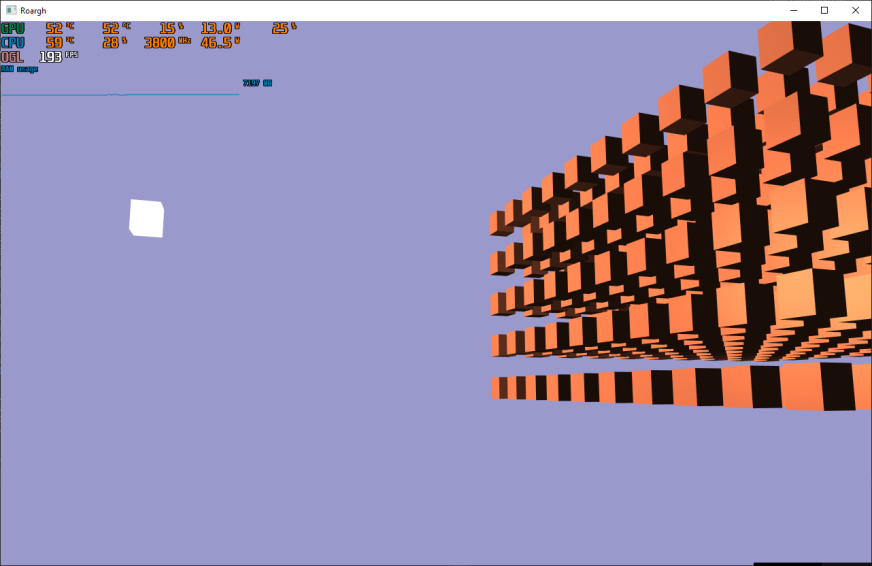

# opengl-tests
pippity poppity ur lib is now my property
- [x] Perspective System
- [x] Ambient Lightning
- [x] Diffuse Lightning
- [x] Specular Lightning
- [ ] Metarials
- [ ] Model Loading
#### Result is...

